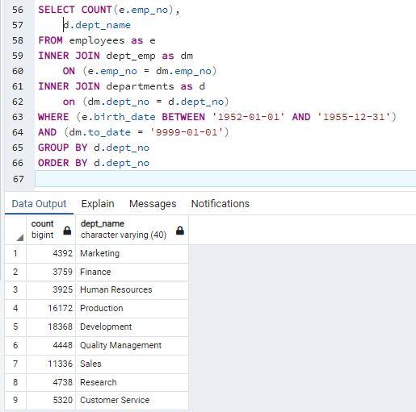

# Pewlett-Hackard-Analysis

## Overview of the Analysis:

  The purpose of this analysis was to work with Bobby to create a SQL database to store essential employee information for Pewlett-Hackard rather than the manual csv files that were previously used. To do this, first we took the existing csv's and mapped out a relational database using an Entitity Relationship Diagram (ERD). This shows the fields used in each table, key fields to identify unique datapoints in each table, and the relationships between tables as seen in the following diagram:
  


  This diagram was then used to create exact copies of the files in a database, using each field and key to create our SQL tables. Once we set up the SQL in PostGRES to handle the employee database, we were able to manipulate and explore the data itself using SQL queries to provide Bobby's manager with important insights into the employee population at P-H. An example of some of the data exploration is finding the retirement eligible employees:
  


And then narrowing it down to currently employeed retirement eligible:


  
## Results

* There are 72,458 employees eligible for retirement. This was calculated here after joining tables:
```
SELECT COUNT(title), title
-- INTO retiring_titles
FROM unique_titles
GROUP BY(title)
ORDER BY COUNT(title) DESC
```
* The total workforce at Pewlett-Hackard is 240,124. That means ~30% of the workforce is eligible to retire.
* From this total, 50,842 are senior employees and two managers. This leaves a huge void of higher-level talent left to be filled.


* The mentorship program has 1,549 eligible employees. These employees are ~10 years younger than the huge chunk of retiring employees, but even if all of them are suited to fill bigger shoes, many of them already have "Senior" in their title. This will only fill a bit over 2% of the vacancies that will be left if all those who are eligible to retire, do so. 

## Summary
  Overall, the top-brass at Pewlett-Hackard is facing a huge problem with the upcoming 'silver tsunami' where ~30% of their entire workforce is reaching retirement eligibility all at once. This means 72,458 roles will need to be filled. The number retiring was found above by totaling the unique retiring titles, while the total number retiring is found by:
```
-- Total Employees
SELECT Count(e.emp_no)
FROM employees as e
INNER JOIN dept_emp as d
	ON (e.emp_no = d.emp_no)
WHERE (d.to_date = '9999-01-01')
```
There are not nearly enough employees to mentor the necessary ~72 thousand positions. The 1,549 eligible for the mentoring program according to the guidelines set would mean ~47 mentees per each mentor. Further discussion might need to be had between each Chief Executive and their senior members to see how to handle their particular employee training programs, as seen here some departments are hit harder than others:



